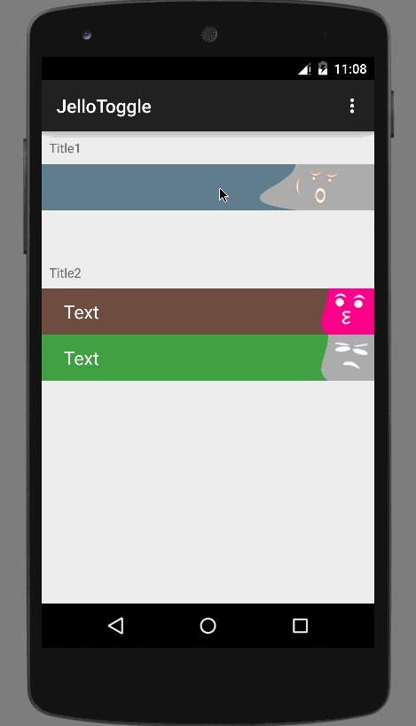

JelloToggle
=============

An impressive Toggle design firstly made by [lexrus](https://github.com/lexrus) and implemented on iOS platform [here](https://github.com/lexrus/LTJelloSwitch).
Here I implement it on Android. A little bit different. And thanks lexrus for the emotion picture, I just clip them out in orignal picture. You can replace them by your own.

Quick Look
============


Usage
=============

```xml
    <me.fichardu.jellotoggle.JelloToggle
        android:id="@+id/jello1"
        android:layout_width="match_parent"
        android:layout_height="50dp">

        <TextView
            android:layout_width="match_parent"
            android:layout_height="match_parent"
            android:gravity="center_vertical"
            android:paddingLeft="24dp"
            android:text="Text"
            android:textSize="20sp"
            android:textColor="@android:color/white"
            android:background="#ff607D8B"
            />
    </me.fichardu.jellotoggle.JelloToggle>

```

```java
setCheckedJelloColor(int color);
setCheckedDrawable(Drawable drawable);
setOnCheckDrawable(Drawable drawable);
setUnCheckedDrawable(Drawable drawable);
setCheckedChangeListener(OnCheckedChangeListener listener);
```

JelloToggle extends FrameLayout, so you can put a View or a ViewGroup in it. 
